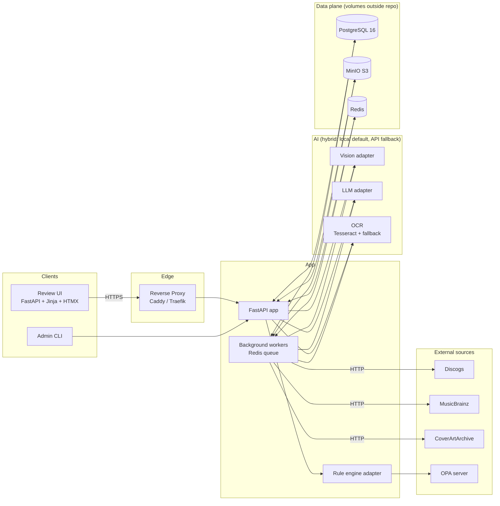
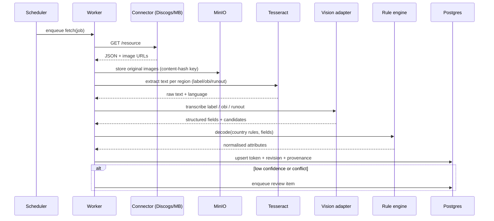

# Architecture

## Context

MediaCat ingests metadata and imagery for physical music media (vinyl + CD)
from a configurable set of sources, enriches it with OCR, vision-model
transcription, and country-specific decoding, and stores the result as an
append-only token-object registry with revisions. Humans review anything
the pipeline flags as unclear, conflicting, or novel.

## Component view

## Invariants

1. **Data/code separation** — All persistent state lives on host-mounted
   volumes under `${MEDIACAT_DATA_ROOT}` and is never part of a Docker
   image. A code upgrade is `docker compose pull && up -d`; no data
   migration is implicit.
2. **Least privilege** — Three DB roles (`mediacat_migrator`,
   `mediacat_app`, `mediacat_readonly`). The app never runs DDL.
3. **Append-only history** — Token objects are immutable; every change is
   a new revision with a provenance record. Reference tables can be
   updated but require reviewer approval.
4. **LLM advisory, not authoritative** — LLMs propose, humans dispose.
   Schema-drift detection raises alerts and drafts patches, it never
   merges them.
5. **Security-by-default** — Non-root containers, strict CSP, Argon2id
   password hashing, rate-limited login, CSRF tokens on every mutating
   form, parameterised queries only.

## Runtime flow (ingestion)

## Deployment topology

Single-host Docker Compose for v1. Each concern is its own container; all
data volumes live under `${MEDIACAT_DATA_ROOT}` with mode `0750` and
secrets at `0700`. A reverse proxy terminates TLS and is the only
container bound to the public interface.

## See also

- [ADR-0001 Media scope](adr/0001-media-scope.md)
- [ADR-0002 Hybrid AI deployment](adr/0002-hybrid-ai.md)
- [ADR-0003 Rule engine choice](adr/0003-rule-engine.md)
- [ADR-0004 Data/code separation](adr/0004-data-code-separation.md)
- [ADR-0005 Web UI stack](adr/0005-web-stack.md)
